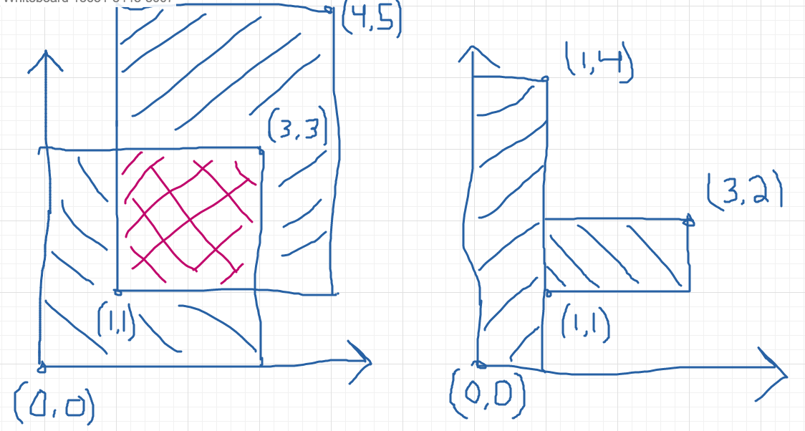

**preprubychallenges**

[The Ruby challenge problems from the Markup and Coding course of the Viking Code School Prep Work](http://www.vikingcodeschool.com/web-markup-and-coding/level-up-your-ruby-judo)

<https://www.vikingcodeschool.com>

# Ruby Calisthenics

## Power

Write a method *power* which takes two integers (*base* and *exponent*) and 
returns the *base* raised to the power of *exponent*. Do not use Ruby's "\*\*"
operator for this!

    > power(3,4)
    => 81 # (3*3*3*3)

    def power(base,exponent)
      # returns base raised to the power of exponent without the use of ** operator
    
      a = base
      b = exponent
      c = []
    
      b.times do
        c.push a
      end
    
      p c.inject(1) {|product, n| product * n}
    end
    
    power(3,4)

## Factorial

Write a method *factorial* which takes a number and returns the product of 
every number up to the current number multiplied together.

    > factorial(5)
    => 120 # from 1*2*3*4*5

    def factorial(n)
      # Int => Int
      # Takes a number and returns the product of every number up to 
      # the current number multiplied together
    
      a = []
    
      n.downto(1).each do |i|
        a.push i
      end
    
      p a.inject(1) {|product, n| product * n}
    
    end
    
    factorial(5)

## Uniques

Write a method *uniques* which takes an array of items and returns the array
without any duplicates. Don't use Ruby's *uniq* method.

    uniques([1,5,"frog",2,1,3,"frog"])
    => [1,5,"frog",2,3]

    def uniques(array)
      # Array of Items => Array of Items
      # Takes an array, returns array with duplicate items removed.
      # Write without uniq
    
      no_dupes = []
      couples = array.combination(2)
      groups = array.group_by{|e| e}
    
      groups.each do |g|
        no_dupes.push(g[0])
      end
    
      p no_dupes
    end
    
    uniques([1,5,"frog",2,1,3,"frog"])

## Combinations

Write a method *combinations* which takes two arrays of strings and returns
an array with all of the combinations of the items in them, listing the first
items first.

    > combinations(["on","in"],["to","rope"])
    => ["onto","onrope","into","inrope"]

    def combinations(ary1,ary2)
      # Ary(Str), Ary(Str) => Ary(Str)
      # Takes two arrays of strings, returns an array with all of the combinations
      # of the items in them, listing the first item first.
    
      a = ary1
      b = ary2
    
      c = []
    
      a.each do |s|
        b.each do |x|
          c.push "#{s}#{x}"
        end
      end
    
      p c
    end
    
    combinations(["on","in"],["to","rope"])

## Primes

Write a method *isprime?* which takes in a number and returns *true* if it 
is a prime number.

    > is_prime?(7)
    => true
    > is_prime?(14)
    => false

    def is_prime?(i)
      range = (i-1).downto(2)
    
      range.each do |a|
        #p i%a == 0
      end
    
      p range.any? {|a| i%a == 0}
    end
    
    is_prime?(7)

## Rectangle Overlap

Write a method *overlap* which takes two rectangles defined by the 
coordinates of their corners, e.g. *[[0,0],[3,3]]* and *[[1,1],[4,6]]*,
and determines whether they overlap. You can assume all coordinates are 
positive integers.

    > overlap( [ [0,0],[3,3] ], [ [1,1],[4,5] ] )
    => true
    > overlap( [ [0,0],[1,4] ], [ [1,1],[3,2] ] )
    => false

It doesn't count as overlapping if their edges touch but they do not 
otherwise overwrite each other. As expressed by a sixth grade student:

    def overlap(a,b)
      # Array(Coordinates), Array(Coordinates) => Boolean
    
      # a = [[0,0],[3,3]]
      ax1 = a[0][0]
      ay1 = a[0][1] 
      ax2 = a[1][0]
      ay2 = a[1][1]
    
      awidth = ax2-ax1
      aheight = ay2-ay1
      aarea = awidth*aheight
    
      # b = [[1,1],[4,5]]
      bx1 = b[0][0]
      by1 = b[0][1]
      bx2 = b[1][0]
      by2 = b[1][1]
    
      bwidth = bx2-bx1
      bheight = by2-by1
      barea = bwidth*bheight
    
      #( [ [0  , 0  ],[3  , 3  ] ], [ [1  , 1  ],[4  , 5  ] ] )
      #( [ [ax1, ay1],[ax2, ay2] ], [ [bx1, by1],[bx2, by2] ] )
    
      case a
      when bx1 < ax2 && by1 < ay2
        true
      when bx1 < ax2 && by2 > ay1
        true
      when bx2 > ax1 && by2 > ay1
        true
      when ax1 < bx2 && ay2 > by1
        true
      else
        false
      end
    end
    
    p overlap( [ [0,0],[3,3] ], [ [1,1],[4,5] ] )
    p overlap( [ [0,0],[1,4] ], [ [1,1],[3,2] ] )
    
    # further development needed to explore every case

# A Bigger Challenge: The Counting Game

POSITION! INDEX 0-9! (1..10)

10 friends are sitting in a circle around a table and decide to play a new 
game. In it, they count up through the numbers from 1 to 100. The first person
says "1", the second says "2" and so on&#x2026; but with a few catches:

-   Whenever the number is divisible by 7, they switch directions. So person 6 
    will say "6", person 7 will say "7", then person 6 again will say "8".
    
        when x%y == 0 # reverse

-   Whenever the number is divisible by 11, they skip the next person for the 
    following number. For instance, if person 3 says "33", person 5 will say 
    "34" instead (person 4 gets skipped).
    
        friends = []
        10.times do 
          friends.push 0
        end
    
        # Produces each number and which person said it
        # Hash {Person(Int)=>List of Numbers(Array of Integers)}
    
        friends = 10
        persons = []
        
        friends.times do
          persons.push []
        end
        
        count = 0
        pos = 0
        inc = +1
        
        until count > 99
          pos = pos%10
          count = count+1
        
          if count%11 == 0
            persons[pos].push "#{count} >>>>"
            pos = pos+(2*inc)
          elsif count%7 == 0
            persons[pos].push "#{count} <<"
            pos = pos-inc
            inc = -1
          else
            persons[pos].push "#{count} >>"
            pos = pos+inc
          end
        
        end
        
        persons.each_with_index do |p,index|
          puts "person #{index+1} says:"
          p.each do |i|
            p i
          end
          puts "\n"
        end

<table border="2" cellspacing="0" cellpadding="6" rules="groups" frame="hsides">

<colgroup>
<col  class="left" />

<col  class="left" />

<col  class="left" />

<col  class="left" />

<col  class="left" />

<col  class="left" />

<col  class="left" />

<col  class="left" />

<col  class="left" />

<col  class="left" />

<col  class="left" />

<col  class="left" />

<col  class="left" />
</colgroup>
<tbody>
<tr>
<td class="left">1 >></td>
<td class="left">12 >></td>
<td class="left">25 >></td>
<td class="left">38 >></td>
<td class="left">49 <<</td>
<td class="left">51 >></td>
<td class="left">62 >></td>
<td class="left">64 >></td>
<td class="left">75 >></td>
<td class="left">84 <<</td>
<td class="left">86 >></td>
<td class="left">97 >></td>
<td class="left">99 >>>></td>
</tr>

<tr>
<td class="left">2 >></td>
<td class="left">24 >></td>
<td class="left">35 <<</td>
<td class="left">37 >></td>
<td class="left">48 >></td>
<td class="left">50 >></td>
<td class="left">61 >></td>
<td class="left">74 >></td>
<td class="left">83 >></td>
<td class="left">85 >></td>
<td class="left">96 >></td>
<td class="left">&#xa0;</td>
<td class="left">&#xa0;</td>
</tr>

<tr>
<td class="left">3 >></td>
<td class="left">11 >>>></td>
<td class="left">23 >></td>
<td class="left">34 >></td>
<td class="left">36 >></td>
<td class="left">47 >></td>
<td class="left">60 >></td>
<td class="left">73 >></td>
<td class="left">82 >></td>
<td class="left">95 >></td>
<td class="left">&#xa0;</td>
<td class="left">&#xa0;</td>
<td class="left">&#xa0;</td>
</tr>

<tr>
<td class="left">4 >></td>
<td class="left">10 >></td>
<td class="left">21 <<</td>
<td class="left">46 >></td>
<td class="left">59 >></td>
<td class="left">70 <<</td>
<td class="left">72 >></td>
<td class="left">81 >></td>
<td class="left">94 >></td>
<td class="left">&#xa0;</td>
<td class="left">&#xa0;</td>
<td class="left">&#xa0;</td>
<td class="left">&#xa0;</td>
</tr>

<tr>
<td class="left">5 >></td>
<td class="left">9 >></td>
<td class="left">20 >></td>
<td class="left">22 >>>></td>
<td class="left">33 >>>></td>
<td class="left">45 >></td>
<td class="left">56 <<</td>
<td class="left">58 >></td>
<td class="left">69 >></td>
<td class="left">71 >></td>
<td class="left">80 >></td>
<td class="left">91 <<</td>
<td class="left">93 >></td>
</tr>

<tr>
<td class="left">6 >></td>
<td class="left">8 >></td>
<td class="left">19 >></td>
<td class="left">32 >></td>
<td class="left">57 >></td>
<td class="left">68 >></td>
<td class="left">79 >></td>
<td class="left">90 >></td>
<td class="left">92 >></td>
<td class="left">&#xa0;</td>
<td class="left">&#xa0;</td>
<td class="left">&#xa0;</td>
<td class="left">&#xa0;</td>
</tr>

<tr>
<td class="left">7 <<</td>
<td class="left">18 >></td>
<td class="left">31 >></td>
<td class="left">42 <<</td>
<td class="left">44 >>>></td>
<td class="left">55 >>>></td>
<td class="left">67 >></td>
<td class="left">78 >></td>
<td class="left">89 >></td>
<td class="left">&#xa0;</td>
<td class="left">&#xa0;</td>
<td class="left">&#xa0;</td>
<td class="left">&#xa0;</td>
</tr>

<tr>
<td class="left">17 >></td>
<td class="left">28 <<</td>
<td class="left">30 >></td>
<td class="left">41 >></td>
<td class="left">43 >></td>
<td class="left">54 >></td>
<td class="left">&#xa0;</td>
<td class="left">&#xa0;</td>
<td class="left">&#xa0;</td>
<td class="left">&#xa0;</td>
<td class="left">&#xa0;</td>
<td class="left">&#xa0;</td>
<td class="left">&#xa0;</td>
</tr>

<tr>
<td class="left">14 <<</td>
<td class="left">16 >></td>
<td class="left">27 >></td>
<td class="left">29 >></td>
<td class="left">40 >></td>
<td class="left">53 >></td>
<td class="left">66 >>>></td>
<td class="left">77 >>>></td>
<td class="left">88 >>>></td>
<td class="left">100 >></td>
<td class="left">&#xa0;</td>
<td class="left">&#xa0;</td>
<td class="left">&#xa0;</td>
</tr>

<tr>
<td class="left">13 >></td>
<td class="left">15 >></td>
<td class="left">26 >></td>
<td class="left">39 >></td>
<td class="left">52 >></td>
<td class="left">63 <<</td>
<td class="left">65 >></td>
<td class="left">76 >></td>
<td class="left">87 >></td>
<td class="left">98 <<</td>
<td class="left">&#xa0;</td>
<td class="left">&#xa0;</td>
<td class="left">&#xa0;</td>
</tr>
</tbody>
</table>

    nil

Your job is to code a program which outputs each number and which person said 
it. Use it to show that  player 1 will say the number "100".

Tips:

-   Remember to stick with brute force instead of trying to "figure out" the 
    trick to the problem.
-   Name your variables well!
-   Ignore the skipping to start out with. Only add it when you're ready.

Advanced Option:

-   Make your method take two inputs &#x2013; the number of players and the number 
    you're counting up to. Then see who says the last number each time!

## The Elevator

You live in a 25 story building with one elevator. The central 
microcontroller got eaten by rats and the building manager has asked you to 
code up the elevator's operating procedure until he can get a new one. You 
figure you'll have to learn to actually code soon but you first want to think
things through and pseudocode your design.

### Elevator Details

The basic elevator machinery is completely dumb (it doesn't do anything it's
not told to do) but is capable of interpreting and executing the commands:

-   "open elevator door"
-   "close elevator door"
-   "go up full speed"
-   "go down full speed"
-   "slow down"
-   "stop"

&#x2026;and it accepts user input in the form of:

-   floor buttons inside the elevator
-   door open and close buttons inside the elevator
-   up and down call buttons on each floor

&#x2026;and it has sensors for:

-   if a human is in the door closing path
-   if it is currently at a floor (instead of in-between floors)

&#x2026;and it has a few quirky requirements:

-   it must "slow down" at least 1 floor before it stops.
-   there is a small chance that it actually stops between floors by 
    accident (it's an old elevator)

### The Task

Your job is to design a properly working elevator. It should stop on each 
floor it is physically able to during a given trip to pick up whoever is 
going the same direction. Additionally, make sure that no one is:

1.  smashed into the ground
2.  pushed through the roof
3.  squished by the doors
4.  let off in between floors
5.  stuck going the wrong direction (unless they choose not to exit)

This will be good practice thinking about all the edge cases and scenarios 
that a user can do.

The point isn't to follow any strict guidelines of syntax but rather to 
focus on getting the logic of the problem figured out and then organizing it
into modules that accomplish the sub-tasks that are required.

Think about:

-   Using a loop around everything to keep your pseudocode (and elevator) 
    running.
-   Writing everything in one giant mess to start with and then refactoring it
    to break apart the modules so it feels less cluttered and messy.

### Use Modules!

This exercise is large enough that you will need to break your code up into
modules. Remember the SOLID lessons &#x2013; modules should only have one major 
purpose. For this exercise, you can use other modules by simply calling 
their name in plain english and writing them out as separate programs down
below your main program. They could be groups of procedural instructions 
like "slow down the elevator if necessary", which runs the 
"ReachedADestinationFloor?" program.

<https://en.wikipedia.org/wiki/SOLID>(object-orienteddesign)
<https://www.vikingcodeschool.com/software-engineering-basics/solid-design-principles>

    PROGRAM Elevator:
        # other code
        slow down the elevator if necessary
        # other code
    END
    
    # other code
    
    PROGRAM SlowDownIfNecessary
        IF we are traveling up at full speed
            IF we are only 1 floor away from the lowest destination floor
                slow down
            END
        ELSE IF we are traveling down at full speed
            IF we are only 1 floor away from the highest destination floor
                slow down
            END
        END
    END

## NB: Software Engineering

<https://www.vikingcodeschool.com/software-engineering-basics>

-   "logic" way through problems
    -   pseudocoding ("whiteboarding")
        -   software design
            -   solve problem first THEN code the solution
            -   break Problem apart into individual sub-processes called "Modules"
                -   Modules Interface
                    -   keep modules as independent as practically possible (aim for low "Coupling")
                    -   make sure modules are all working towards the same goal (are highly "Cohesive")
                    -   try to keep modules insulated from how other modules actually do 
                        their job (keep them highly "Encapsulated")
            -   SOLID principles
    
    -   modular design and engineering best practices
    -   4-step engineering problem solving approach
        1.  Understand the problem
        2.  Plan a solution
        3.  Carry out that plan
        4.  Examine your results for accuracy
    -   Agile development
        -   project management technique / development philosophy
        -   teams commonly work in short (1-2 week) sprints
        -   XP and SCRUM, Agile techniques
            -   short cycle times
            -   frequent client/user interaction
                -   keeps project focused on relevant tasks
            -   XP
                -   pair programming
                    -   pairing developers together at workstations
        -   keep software user-driven
        -   TDD

### Learning Modularity

-   The 3 Characteristics of Good Modules
    
    Essentially, there are just three important guidelines for how modules 
    should operate and interact. These high level principles essentially guide
    the theory behind modularity &#x2013; it's good to break things into pieces, 
    those pieces shouldn't rely on each other for much, each piece should do 
    its own thing, and pieces should talk to each other using pre-determined
    interfaces.
    
    Modules should have:
    
    1.  Low Coupling &#x2013; they should be minimally dependent on each other and 
        communicate using specified interfaces
        -   forcing modules to communicate with each other only by using 
            specified interfaces
    
    2.  High Cohesion &#x2013; they should be focused completely on achieving the 
        overall goal
    
    3.  High Encapsulation &#x2013; they shouldn't reveal their implementation 
        details to anyone else (and shouldn't need to)

-   5 key engineering principles. SOLID
    1.  **Single Responsibility Principle (SRP)** 
        
        modules should only exist to serve one purpose and may only change if 
        that purpose is modified
    
    2.  **Open/Closed Principle (OCP)**
        
        modules should be open for extension but closed to modification
    
    3.  **Liskov Substitution Principle (DIP)**
        
        modules that inherit from a parent should not alter any of that 
        parent's functionality
    
    4.  **Interface Segregation Principle (ISP)**
        
        each different user of a module should get to access it via a 
        specialized interface that only requires them to supply the minimal 
        amount of information
    
    5.  **Dependency Inversion Principle (DIP)**
        
        higher level modules should dictate the implementation details of lower
        level modules, not the other way around
